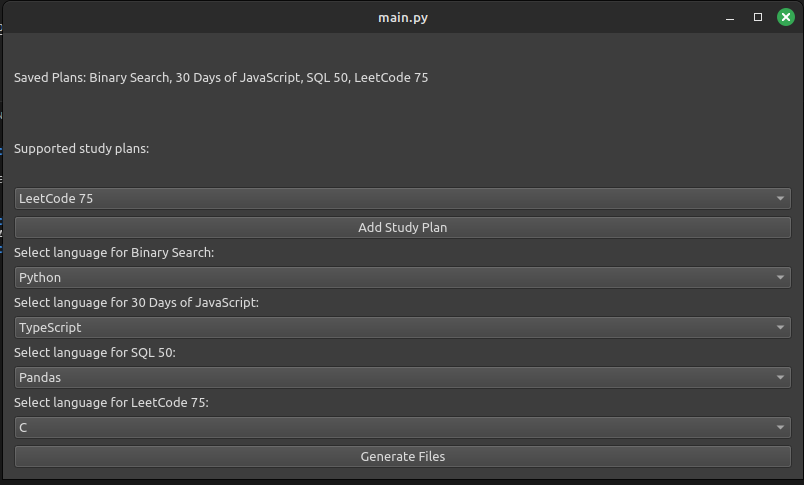
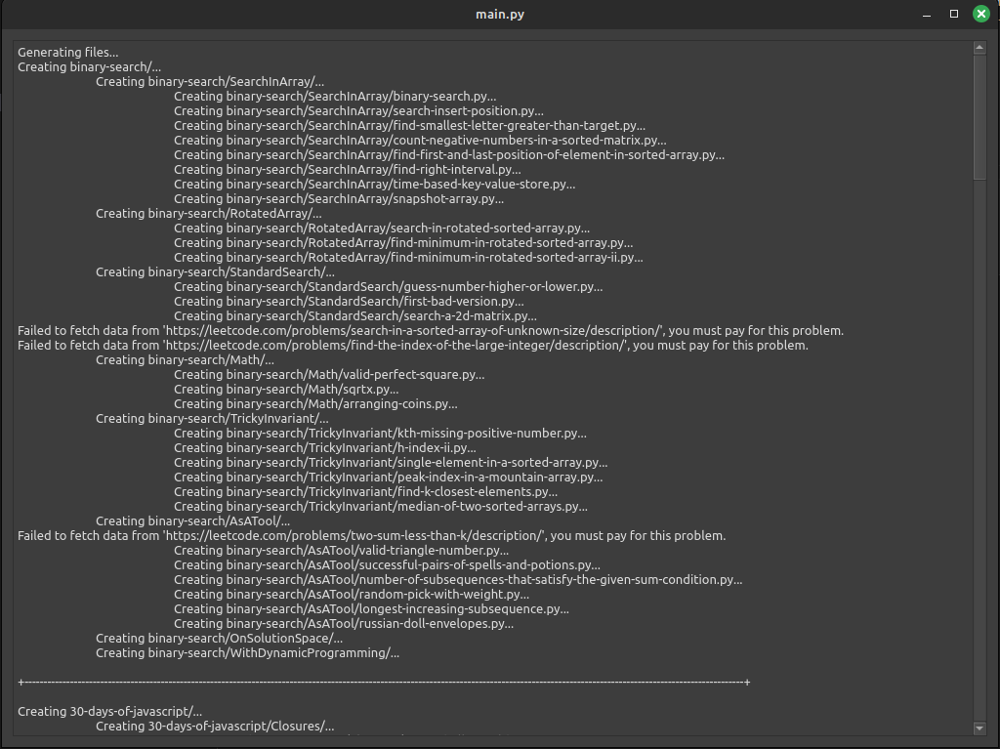
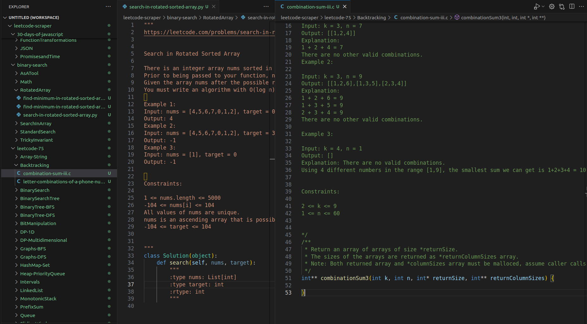

# LeetCode Scraper 
This project is a Python script that asks users which LeetCode study plans they would like to study and then scrapes Leetcode for the associated problems. The application uses a GUI made using GUI to ask the user which study plans they want to fetch as well as their preferred programming language. The script then makes a folder for each study plan, a folder for each problem-type within that study-plan, and multiple files (with the user's preferred language) that has the question, and associated code-snippet for each problem. This project is useful for those who don't want to work on LeetCode from the website directly, and instead work locally. This is also useful if one wishes to make a git repository for LeetCode problems.

## Screenshots & Demo
### Screenshots

## Portfolio Properties
- showOnPortfolio = true
- path = media/
